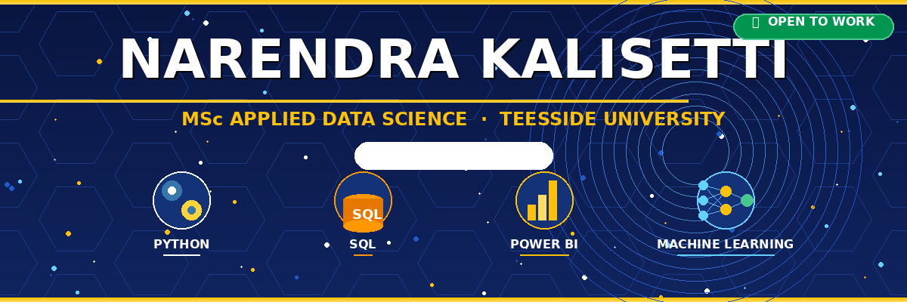
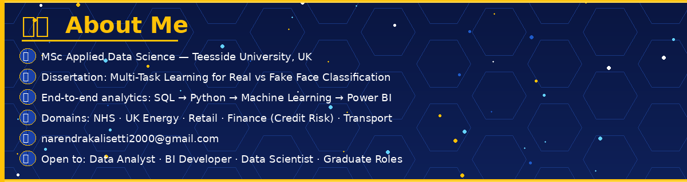
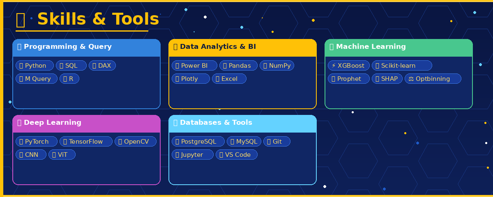
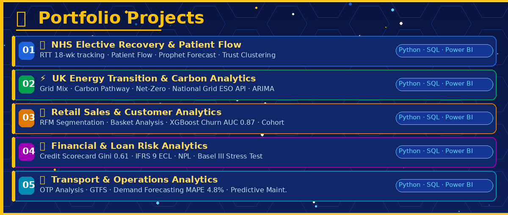
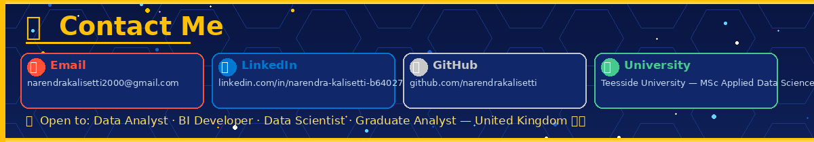

---

---

## 🧠 Who Am I?

Hey there! 👋 I'm **Narendra Kalisetti**, a passionate **Data Analyst & BI Developer** completing my **MSc in Applied Data Science** at **Teesside University, UK** 🎓

I build end-to-end analytics solutions — raw data → SQL modelling → Python pipelines → Machine Learning → Power BI dashboards that tell a clear story 📊

**5 real-world portfolio projects** across:
🏥 **NHS Healthcare** · ⚡ **Energy & ESG** · 🛒 **Retail** · 💳 **Finance & Credit Risk** · 🚌 **Transport**

> 🟢 **Actively seeking:** Data Analyst · BI Developer · Data Scientist · Graduate Analyst roles in the **UK**

---

## 🛠️ Skills & Tools

### 💻 Programming & Query Languages

### 📊 Data Analytics & BI

### 🤖 Machine Learning & AI

### 🧠 Deep Learning (Dissertation)

### 🗄️ Databases & Dev Tools

---

## 📂 Portfolio Projects

---

### 🏥 01 · NHS Elective Recovery & Patient Flow Analysis
[

> Tracking NHS elective care backlog recovery post-COVID across 200+ NHS Trusts

| What I Built | Result |
|---|---|
| 📊 RTT 18-week performance tracker | 62% of Trusts missed target in Q1 2023 |
| 🔀 Patient flow: A&E → Admission → Treatment → Discharge | Correlation A&E & RTT: r = 0.71 |
| 📈 Prophet waiting list forecasting | RMSE: 3.2% over 12-month horizon |
| 🤖 K-means Trust clustering | 3 tiers: High Performer / Recovering / At Risk |
| 🗺️ Power BI 6-page dashboard | Geographic map + benchmarking + forecast |

`Python` `PostgreSQL` `Prophet` `Scikit-learn` `Power BI` `DAX`

---

### ⚡ 02 · UK Energy Transition & Carbon Analytics

> Tracking the UK's journey to net-zero using live National Grid ESO API data

| What I Built | Result |
|---|---|
| ⚡ Live grid generation mix (API pull) | Renewables hit 42.8% share in 2023 |
| 🌍 Carbon pathway vs CCC net-zero targets | 46% below 1990 baseline by 2023 |
| 📉 Offshore wind LCOE trend | Cost dropped 78% since 2015 |
| 🌐 G7 international benchmarking | UK ranked 3rd among G7 nations |
| 🔮 Carbon forecasting (ARIMA + Prophet) | 3× build rate needed to hit 2030 target |

`Python` `National Grid ESO API` `ARIMA` `Prophet` `PostgreSQL` `Power BI`

---

### 🛒 03 · Retail Sales & Customer Analytics

> Full retail analytics suite — segmentation, basket analysis & churn prediction

| What I Built | Result |
|---|---|
| 👥 RFM customer segmentation (8 tiers) | Top 20% customers = 68% of revenue |
| 🛍️ Market basket analysis (Apriori) | 3.4× product association lift found |
| 🔮 XGBoost churn prediction | **AUC: 0.87** — 72% of churners caught 60 days early |
| 📅 Monthly cohort retention | Cost-of-living impact visible in Q3 2023 |
| 📊 YoY channel performance | Online +34% YoY vs flat in-store |

`Python` `XGBoost` `MLxtend` `Scikit-learn` `SHAP` `PostgreSQL` `Power BI`

---

### 💳 04 · Financial & Loan Risk Analytics

> Credit risk analytics aligned with Basel III & IFRS 9 regulatory frameworks

| What I Built | Result |
|---|---|
| 📋 Logistic regression credit scorecard | **Gini: 0.61 · AUC: 0.80 · KS: 42%** |
| 🔍 WOE/IV feature engineering | DTI, credit score & loan purpose = top 3 drivers |
| 🏦 IFRS 9 ECL across 3 stages | Total ECL modelled: £128M |
| ⚠️ Basel III stress testing | Severe recession NPL rises to 11.7% |
| 📉 Vintage & roll rate analysis | PSI: 0.11 — scorecard stable ✅ |

`Python` `Scikit-learn` `Optbinning` `XGBoost` `SHAP` `PostgreSQL` `Power BI`

---

### 🚌 05 · Transport & Operations Analytics

> Bus & rail network analytics — OTP, fleet utilisation & predictive maintenance

| What I Built | Result |
|---|---|
| 🚍 GTFS feed parser + OTP pipeline | Network OTP: 78.3% vs 85% target |
| 🔍 Delay root cause analysis | Top 5 routes = 43% of all delay minutes |
| 📈 Prophet demand forecasting | **MAPE: 4.8%** on 4-week ahead predictions |
| 🔧 Random Forest predictive maintenance | 67% of failures caught 14+ days early |
| 💰 Fleet optimisation model | ~£340K/year dead mileage savings identified |

`Python` `GTFS-Kit` `Prophet` `Scikit-learn` `PostGIS` `Power BI` `DAX`

---

## 🔬 Dissertation Research

| | |
|---|---|
| 📌 **Title** | Multi-Task Learning for Real vs Fake Face Classification |
| 🎓 **University** | Teesside University — MSc Applied Data Science |
| 🧠 **Domain** | Deep Learning · Computer Vision · Deepfake Detection |
| 🔧 **Tech** | PyTorch · OpenCV · TensorFlow · CNN · Vision Transformers |

Researching **Multi-Task Learning (MTL)** architectures that simultaneously classify facial images as **real or AI-generated (deepfake)**, sharing learned representations across auxiliary tasks to boost generalisation and efficiency 🧠

---

## 📊 GitHub Stats

---

## 📫 Contact Me

| 📬 | Contact |
|---|---|
| 📧 **Email** | [narendrakalisetti2000@gmail.com](mailto:narendrakalisetti2000@gmail.com) |
| 💼 **LinkedIn** | [linkedin.com/in/narendra-kalisetti-b640271b9](https://www.linkedin.com/in/narendra-kalisetti-b640271b9) |
| 🐙 **GitHub** | [github.com/narendrakalisetti](https://github.com/narendrakalisetti) |
| 🎓 **University** | Teesside University — MSc Applied Data Science |
| 📍 **Location** | United Kingdom 🇬🇧 |

 

---

### 🟢 Open to Opportunities in the UK 🇬🇧

💼 **Data Analyst** &nbsp;·&nbsp; 📊 **BI Developer** &nbsp;·&nbsp; 🤖 **Data Scientist** &nbsp;·&nbsp; 🎓 **Graduate Analyst**

*Recruiter or hiring manager? Please reach out via email or LinkedIn — happy to connect!*

---

*"Without data, you're just another person with an opinion." — W. Edwards Deming*

